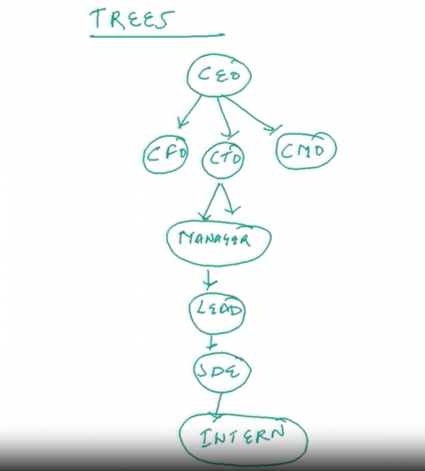

# TREES-DSA
Trees-javascript
| 1. | **Tree-and-its-types**                                                                                                                                                        |
| ---| ------------------------------------------------------------------------------------------------------------------------------------------------------------------------------------------------------------------------------------|
|    | How can be used                                                                                                                                                          |
| 1 | [what are trees](#)                                                                                                                                                       |
| 2 | [Types of trees](#)                                                                                                                                                       |
| 3 | [Height balanced binary trees](#)                                                                                                                                         |                                                                                                                                                         
| 4 | [Level order traversal](#)                                                                                                                                                |
| 5 | [Level order travesal implementation](#)                                                                                                                                  |
| 6 | [Post order traversal](#)                                                                                                                                                 |
| 7 | [Posr order traversal implementation](#)                                                                                                                                  |
| 8 | [In order traversal](#)                                                                                                                                                   |
| 9 | [Terms related to trees](#)                                                                                                                                               |
| 8 | [Pree order traversal ](#)                                                                                                                                                |       
| 9 | [Pree order traversal implementation ](#)                                                                                                                                | 
| 10 | [In order traversal implementation ](#)                                                                                                                                 |    

| 1 | [what are trees](#)  
# Trees and its subtypes

| 2 | [Types of trees](#)    
# Trees and its types

| 3 | [Height balanced binary trees](#)    
# Height balanced trees

